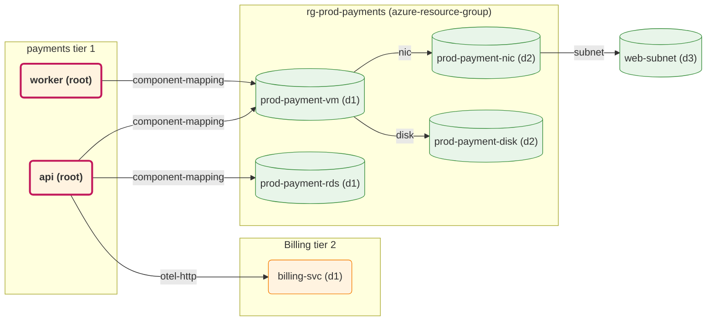
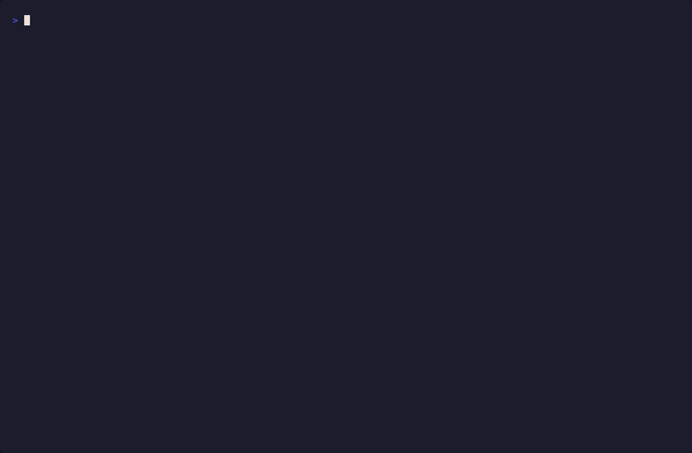
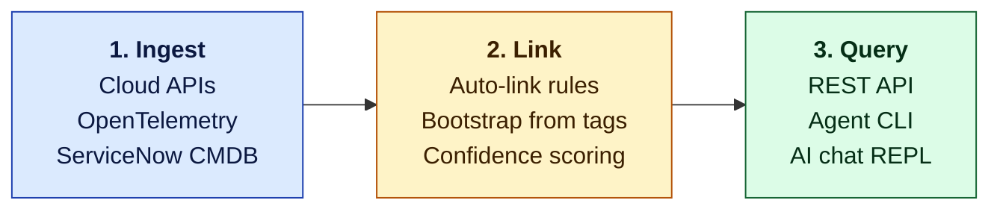

# AppCloud — the memory layer for infrastructure intelligence

> Answer **"if X changes, what's affected?"** with traceable evidence — across AWS, Azure, GCP, your applications, and your dependencies.

AppCloud ingests your cloud inventory, links it to your applications and components, and stores everything as a property graph. Then you ask questions in plain English and get answers grounded in real edges, not guesses.


---

## The 30-second pitch

```sh
$ node agents/run.js blast-radius --subject \
    "What apps are affected if [seed] prod-payment-rds restarts?"

[Blast Radius] Tool: list_infra
[Blast Radius] Tool: get_impact { id: a546ed4a-... }
[Blast Radius] Response:

Changing [seed] prod-payment-rds affects 1 component across 1 application,
including 1 Tier-1 app.

Affected Components:  [seed] payment-db (database)
Affected Applications: [seed] Payment Gateway (Tier 1, prod)

BLAST_RADIUS_RESULT:
- Subject: [seed] prod-payment-rds
- Affected components: 1 ([seed] payment-db)
- Affected applications: 1 (Tier-1: 1)
- Risk: MEDIUM
- Specific concerns: Impacts a Tier-1 application.
```

That's the Blast Radius agent — one of three that ride on top of the graph. Every claim is backed by `:CONNECTS_TO` edges with `source`, `via`, `confidence`, and `evidence` properties; nothing is hallucinated.

---

## The same answer, as a picture

The agent's narrative comes from a graph walk. You can ask for the walk directly and render it inline — `GET /graph/visualize?id=<app-or-component-or-infra>` returns Mermaid (or DOT, `?format=dot`) you can paste into a runbook, design doc, or incident ticket. GitHub renders Mermaid natively, so the dependency picture lives wherever the conversation is:



Components are grouped by Application, Infra is grouped by resource-group / project / account-region, edges are labelled with the structural `via` (`nic`, `subnet`, `component-mapping`, `otel-http`, …), and the root nodes are emphasised. Same shape works for the inverse direction:

```sh
# What breaks if prod-payment-rds restarts? Inbound walk, piped into Graphviz.
curl -sH "X-API-Key: $KEY" \
  "$BASE/graph/visualize?id=$RDS_ID&direction=inbound&format=dot" | dot -Tpng > impact.png
```

---

## Why it exists

Cloud inventory tools tell you **what** you have. Tagging tools tell you **whose** it is. Application performance tools tell you **how** it's behaving.

None of them tell you **what depends on what**, with traceable evidence, when you need to make a decision in the next ten minutes.

AppCloud's job is to be the durable memory for that question. It runs alongside your existing observability stack — pulls inventory from the same cloud APIs you already trust, optionally enriches with Network Watcher / VPC Flow Logs / OpenTelemetry / ServiceNow CMDB, and answers structural questions through a small CLI, a chat REPL, or a REST API.

---

## What AppCloud is — and isn't

| It is | It isn't |
|---|---|
| A graph-backed memory layer that answers **structural** questions about your infrastructure | An **APM** — use Datadog / New Relic / Grafana for *behavioural* questions ("why is latency spiking *right now*?") |
| A **blast-radius and dependency-mapping** tool | A **change-management workflow** — it tells you what a change would affect; it doesn't run the change |
| An **ingestor** that pulls from cloud APIs, OpenTelemetry, and ServiceNow CMDB | A **replacement** for those systems — they remain authoritative |
| **Read-only** on your cloud accounts (it never modifies a resource) | A **configuration tool** — it doesn't deploy or change anything |

If your question starts with *"what depends on…"*, *"what would break if…"*, *"who owns…"*, or *"what's in this resource group that I forgot about?"* — AppCloud is the right tool.

---

## Three scenarios

> The examples below use the demo tenant produced by `node seed.js` — every resource name is prefixed `[seed]`. On your own data, the prefix won't be there; everything else works the same.

### 🛠️ Support — *"On-call: User Portal just paged"*

A page lands at 02:14. The runbook says "see if any deploys are in flight" but the deploy console is in a different tool. AppCloud's chat tells you what the impacted app actually depends on so you know where to start looking.



You get back the apps it talks to, the cross-app dependency counts, and an honest "no apps depend on this" when nothing does. **Not a wiki page someone forgot to update — a query against the live graph, with no hallucinated entities** (the chat refuses to invent dependencies that aren't on the wire).

### 🏗️ Platform — *"Pre-change review: upgrading prod-payment-rds"*

You're about to change instance class on a production database. Before you submit the maintenance window:

```sh
$ node agents/run.js blast-radius --subject \
    "What apps are affected if [seed] prod-payment-rds restarts?"
```

Output (real, from the demo above): **1 Tier-1 app affected (Payment Gateway), 1 component (payment-db), risk MEDIUM**. Includes the path of evidence — which `:CONNECTS_TO` edges connect the infra to the components to the application — so reviewers don't have to take it on trust.

### 🔎 Both — *"Discovery: link the orphan resources"*

The seed leaves 7 unmapped infra rows after a fresh inventory pull (mystery VMs, a sandbox EKS cluster, an orphan S3 bucket). Run the mapping agent and it'll **link the obvious ones in Pass 1** (high-confidence suggestions ≥70 score), then **propose new Applications and Components for the rest** in Pass 2 using tag and naming-pattern inference:

```sh
$ node agents/run.js map
[Mapping] Pass 1 linked: 4
[Mapping] Pass 2 components created: 2
[Mapping] Pass 2 applications created: 1
[Mapping] Still unmapped: 0
```

Every action is auditable: each new edge gets `source: 'auto-link'` or `'auto-created'` plus `evidence: <why>`.

---

## How it works

Three stages, three stores:



1. **Ingest.** Per-cloud scanners (`/discovery/scan/{aws,azure,gcp}`) issue one native-inventory query each (AWS Config aggregator, Azure Resource Graph, GCP Cloud Asset Inventory) and write `(:Infra)` nodes. Optional supplement layers add Network Watcher topology, VPC flow logs, IAM bindings, and OpenTelemetry-observed connections on top.
2. **Link.** Auto-link infers Component → Infra ownership from three signals — co-location (same RG / project / account+region), direct 1-hop structural edges, and 2-hop neighbourhood paths. Bootstrap fills in apps and components from cloud tags. Every inferred edge carries a confidence score and an evidence string.
3. **Query.** Two stores back the answers — **Neo4j** holds the topology graph (every relationship is a `:CONNECTS_TO` edge with `source` / `via` / `confidence` / `evidence` properties); **PostgreSQL** holds operational state — tenants, API keys, audit log, ingestion episodes. The REST API, the CLI agents, and the chat REPL all read from the same graph.

Engineers maintaining the load-bearing conventions (single edge label, scoring tables, why three stages and not two) — see [`CLAUDE.md`](CLAUDE.md).

---

## Quickstart

### If AppCloud is already running on your cluster

Most teams will hit this path — someone else has already deployed the API. You just need the agent CLI on your laptop pointed at it.

```sh
git clone <this repo> && cd appcloud/agents
cp .env.example .env
```

Fill in `agents/.env`:
- `APPCLOUD_API_URL` — your cluster's API base URL (e.g. `https://appcloud.acme.local`)
- `APPCLOUD_API_KEY` — a key minted via `POST /admin/api-keys` (or the bootstrap super-admin secret if you're an operator)
- `GEMINI_API_KEY` — free key from [aistudio.google.com](https://aistudio.google.com), no card required

Then:

```sh
node run.js blast-radius --subject "what breaks if portal-api restarts?"
node run.js chat        # interactive REPL — ask anything about the graph
node run.js map         # two-pass: link orphan infra to apps/components
```

### If you're deploying AppCloud from scratch (operator path)

```sh
# 1. Bring up the local cluster (postgres + neo4j + ollama + api)
./k8s/scripts/deploy-minikube.sh --api-only

# 2. Port-forward + populate the demo tenant
kubectl -n appcloud port-forward svc/api 3000:3000 &
cd agents
cp .env.example .env       # fill in APPCLOUD_API_KEY + GEMINI_API_KEY
node seed.js               # populates the seeded `default` tenant with demo data

# 3. Ask something
node run.js blast-radius --subject "what breaks if [seed] prod-payment-rds restarts?"
```

For real clusters: the same Kustomize bases + per-environment overlays target AKS / EKS / OpenShift. See `k8s/overlays/{aks,eks,openshift}/`.

---

## What you can do with it

| I want to… | Run | What you get back |
|---|---|---|
| **See what would break if I change X** | `node run.js blast-radius --subject "..."` | Plain-English impact summary, list of affected components and applications, risk classification (LOW / MEDIUM / HIGH), and the path of evidence connecting your change to each impact |
| **Link up orphan cloud resources** | `node run.js map` | Two-pass run: high-confidence existing matches linked first (≥70 score), then new applications and components proposed for the rest from cloud tags + naming patterns. Every action is auditable |
| **Pull a fresh inventory** | `node run.js discover` | Triggers `/discovery/scan/{aws,azure,gcp}` for every configured cloud account; reports counts by provider and resource type |
| **Ask anything else** | `node run.js chat` | Interactive REPL backed by `/ai/chat`. Each question gets a fresh snapshot of apps, components, infra, and cross-app deps injected into context — replies are grounded in the live graph |
| **Browse the data directly** | `curl /graph/topology`, `/applications`, `/infra/public/exposed`, `/discovery/resources?mapped=false` | Raw graph access — see [`docs/api-guide.md`](docs/api-guide.md) for the per-domain reference, or import [`docs/api-postman-collection.json`](docs/api-postman-collection.json) into Postman (111 requests, 13 folders) |
| **Plug in a new ingest source** | drop a connector under `api/src/connectors/<kind>/<name>/` | Connectors share a small interface (IaC state backends, OpenTelemetry receivers, CMDB feeds, cloud-account scanners). The framework discovers them at startup |
| **Run a real multi-tenant deployment** | `POST /admin/tenants` with super-admin scope | Per-tenant Postgres `search_path` isolation, per-tenant API keys via `POST /admin/api-keys`, audit log with tenant attribution, isolated Neo4j databases (planned) |

---

## LLM provider support

The agent runner speaks five providers, picked via `AI_PROVIDER` in `agents/.env`:

| Provider | Free tier | Best for |
|---|---|---|
| **`gemini`** ⭐ | 1,500 req/day on Flash, no card | Recommended starter — already wired, no integration work |
| **`groq`** | 14,400 req/day on llama-3.1-8b-instant | Fastest inference; needs a tighter prompt to compensate for smaller models |
| `ollama` | unlimited (your own GPU) | Privacy-safe; local-only |
| `anthropic` | paid | Highest quality, costs $ |
| `azure_openai` | your deployment | When you already pay for Azure |

The chat REPL forwards your provider creds per request via `cloudOverride`, so the cluster doesn't have to know your API key — your laptop does.

---

## Where the code lives (for contributors)

| Path | What's there |
|---|---|
| `api/src/routes/` | 85 REST endpoints, one file per domain (applications, components, infra, graph, discovery, ai, admin-tenants, audit, …) |
| `api/src/services/` | Auto-link, bootstrap, episode tracking, cmdb-assessment |
| `api/src/connectors/` | Pluggable ingest framework (cloud, IaC, OTel, CMDB) |
| `agents/agents/` | Mapping, blast-radius, discovery agents |
| `agents/chat.js` | Interactive chat REPL |
| `agents/lib/agent-runner.js` | Anthropic-tool-shape ↔ OpenAI-compat conversion; 5 LLM providers |
| `docs/{azure,gcp,aws}-*-coverage.md` | Per-cloud scan coverage — what the primary query covers and what supplement layers add |
| [`CLAUDE.md`](CLAUDE.md) | Graph conventions, edge property contract, scoring tables, why three stages |

---

## Status

Pre-customer. The multi-tenant control plane is in place — tenant CRUD, per-tenant API keys, isolated Postgres schemas, audit log with tenant attribution. **Per-tenant data writes are feature-flagged off** until the per-tenant table template lands; tracked in [`docs/TODO-phase-1c.md`](docs/TODO-phase-1c.md). Until then, `agents/seed.js` and the agents write to the seeded `default` tenant.

---

## License

TBD — pre-customer. Contact the project owners before redistributing.

---

*AppCloud is a knowledge-graph platform for infrastructure dependency mapping and blast-radius analysis. It does not collect telemetry. It does not phone home. Every decision it makes is queryable in Cypher.*
