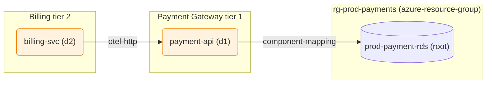

# When the pager fires, what else broke?

A graph-shaped answer to the 10-minute question every change manager and SRE asks — and why the shape matters more than the tool.

---

## The 10-minute question

It's 2:43 AM. The pager goes off. `prod-payment-rds` is degraded — connections backing up, write latency climbing. You're awake now. The first question — the one whose answer decides whether you wake the CTO or just file a P3 — is:

> **What else is affected?**

The second question, ten minutes in, is:

> **What is this thing leaning on that I should also check?**

For most teams, both answers live in (a) the head of whoever built it, (b) a CMDB spreadsheet someone last touched in 2023, and (c) Slack threads scattered across `#payments`, `#sre`, and `#cloud-ops`. None of them are queryable in three seconds. So the team improvises, the bridge call drags on, and MTTR is whatever the slowest archaeology takes.

The same two questions arrive in daylight too — at change review. *"We're patching the VNet on Saturday. What does it touch?"* Same shape, same archaeology, same unfortunate answer: *"let me ask around and get back to you."*

---

## Why this is a graph problem

Most IT tools answer one of three questions:

| Tool type | Tells you |
|---|---|
| Cloud inventory | **What** you have (the VMs, the buckets, the load balancers) |
| Tagging / cost | **Whose** it is (the team, the cost centre) |
| APM / monitoring | **How** it's behaving right now |

None of them tell you **what depends on what**. That's a graph question. It's *only* a graph question — because the answer is a path, not a row, and the interesting paths are 3-6 hops long and cross between "applications", "components", and "infrastructure" the way a flowchart crosses between boxes.

You can fake it in a spreadsheet. People do. The fake breaks the first time someone deploys a new service, and stays broken until someone else gets paged and notices.

The right shape is a **property graph**: nodes for things, typed edges for relationships, properties on the edges that say *who emitted this edge, why, and how confident we are*. Then "what's affected?" is a one-line query: walk outward from the impacted node, collect everything you hit. "What does this depend on?" is the same query, the other direction.

---

## What we built

A REST API and a small set of agents on top of a Neo4j property graph that ingests AWS / Azure / GCP inventory, enriches it with structural relationships (VM → NIC → Subnet → VNet, IAM bindings, observed TCP flows, OTEL traces, ServiceNow CI links), and answers the two questions above as a single graph walk.

The two endpoints:

```bash
# What else is affected if this changes? (Inbound walk.)
GET /graph/impact?id=<application | component | infra>

# What does this depend on? (Outbound walk.)
GET /graph/dependencies?id=<application | component>
```

Both return a depth-aware tree:

- Every reached node carries its `depth` (1 = direct neighbour).
- Every edge carries the full `:CONNECTS_TO` contract: `source` (which scanner emitted it), `via` (the relationship type — `nic`, `subnet`, `component-mapping`, `otel-http`), `confidence` (0-100), and `evidence` (a human-readable explanation).
- Every reached Component is annotated with its owning Application.
- Every reached Infra is annotated with its rollup bucket (Azure resource group, GCP project, AWS account+region) — the same bucket the auto-link rule uses, so dashboards and incident walks agree on grouping.

Same query model handles both directions. **One endpoint, same response shape, opposite arrow.** That's the structural payoff of using a graph: the two questions that look so different in a runbook are the same query.

---

## A worked example

Same incident: `prod-payment-rds` is degraded. The SRE on call runs:

```bash
# Who calls this RDS?
curl -s -H "X-API-Key: $KEY" "$BASE/graph/impact?id=$RDS_ID" | jq .
```

Top of the response:

```json
{
  "root": { "id": "...", "label": "Infra", "name": "prod-payment-rds" },
  "nodes": [
    { "name": "payment-api", "label": "Component", "depth": 1,
      "ownerAppName": "Payment Gateway", "ownerAppTier": 1 },
    { "name": "billing-svc", "label": "Component", "depth": 2,
      "ownerAppName": "Billing", "ownerAppTier": 2 }
  ],
  "rollups": [
    { "kind": "azure-resource-group", "key": "rg-prod-payments", "count": 4 }
  ],
  "edges": [
    { "from": "...payment-api", "to": "...prod-payment-rds",
      "via": "component-mapping", "source": "auto-link", "confidence": 75,
      "evidence": "rule-r2-direct-link" }
  ]
}
```

Answer in 200ms: **one Tier-1 app, one Tier-2 app, all in `rg-prod-payments`.** The SRE knows in three seconds what they would otherwise spend twenty minutes confirming.

But "1 Tier-1, 1 Tier-2" is a list. The actual diagram is the structural picture, and it's the picture that lands in the incident ticket:

```bash
curl -s -H "X-API-Key: $KEY" \
  "$BASE/graph/visualize?id=$RDS_ID&direction=inbound&format=mermaid"
```

Paste into the incident channel. GitHub, Slack-with-Mermaid, Notion, Confluence — anywhere Mermaid renders — shows this:



The diagram tells the rest of the team — including people who weren't on the bridge — *which* Tier-1, *which* Tier-2, what calls what, and where it all lives. Same diagram works on the change-management side: paste it into the CR and reviewers immediately see what's in scope.

For natural-language queries — *"what apps are affected if prod-payment-rds restarts?"* — the bundled Blast Radius agent (LLM with the graph as tools) emits the same diagram plus a short narrative:

```
Changing prod-payment-rds affects 2 components across 2 applications,
including 1 Tier-1 app (Payment Gateway).

Specific concerns: payment-api depends on this RDS directly; billing-svc
reaches it via payment-api (depth 2). All four resources live in the same
rg-prod-payments resource group, so a control-plane issue would compound.

[mermaid diagram embedded inline]

BLAST_RADIUS_RESULT:
- Affected components: 2 (payment-api, billing-svc)
- Affected applications: 2 (Tier-1: 1)
- Risk: MEDIUM
```

---

## For platform engineers and SRE teams specifically

If you've shipped change-management tools before, the questions you have are about **trust** and **integration**. A few specifics:

**Every edge is traceable.** The four required properties on `:CONNECTS_TO` (`source`, `via`, `confidence`, `evidence`) are enforced by a static-analysis test in the repo — you literally cannot merge a writer that emits an un-traceable edge. When the LLM agent says "X depends on Y", you can click through to which scanner emitted that edge, on which API call, with what confidence. No hallucinations; every claim has a receipt.

**Three first-class clouds, one query model.** Azure (Resource Graph), GCP (Cloud Asset Inventory), AWS (Config aggregator) all feed the same `:CONNECTS_TO` shape. Cross-cloud invariants (shared `via` keys like `subnet`, `vpc`, `disk`, `service-account`) keep the same auto-link score regardless of provider. A query against a multi-cloud graph doesn't care which cloud the resource is in.

**Supplements add fidelity, not noise.** Network Watcher and VM Insights for Azure, IAM Policy for GCP, plus OpenTelemetry traces and ServiceNow CMDB CI links — each adds a documented `source` and `via` so you can filter the walk to "only structural" or "include observed traffic" with `?minConfidence=`. Live ↔ inventory disagreement is something the graph surfaces, not something it hides.

**Rollup grouping respects the cloud-account boundary.** Every Infra node carries its co-location bucket (`rg-prod-payments` for Azure, project for GCP, `account-region` for AWS) computed from the same parsers the auto-link rule uses. That means the dashboard tile *"this graph spans 14 resource groups across 3 projects and 2 AWS accounts"* and the incident walk *"this hits 4 resources in rg-prod-payments"* use **the same bucket name**. Cross-walk consistency is structural, not a coincidence.

**Outputs slot into your existing surfaces.** Mermaid for runbooks and PR descriptions (GitHub renders inline). DOT for `dot -Tpng > impact.png` straight into your incident wiki. JSON for whatever else. A `?simplify=10` parameter folds high-cardinality clusters into placeholders so a 300-node walk still renders cleanly on GitHub.

**Bidirectional symmetry by design.** The same `bfsWalk` helper backs both `/graph/impact` and `/graph/dependencies`. Adding a new endpoint that needs reachability — e.g., a webhook that posts a Mermaid diagram to Slack on every PR — is one import and three lines. No parallel implementations to keep in sync.

---

## The MTTR math

The interesting number in incident response isn't TTR (time to resolve). It's TTI — time to identify the blast radius. Most post-mortems show TTI dominating the timeline: thirty minutes of "who else uses this?" before anyone can decide what to do.

A graph query that returns blast radius in 200ms doesn't shave thirty minutes off every incident — sometimes the answer was already known, sometimes the bridge call had to assemble for other reasons. But across the year, across every Tier-1 and Tier-2 incident, the per-incident saving compounds:

- **30s per change CR review** (× thousands of reviews per year)
- **5-15min per Tier-2 incident** (× hundreds)
- **15-45min per Tier-1 bridge call** (× tens — but each one is expensive)

The same query model serves both **proactive** (change risk preview) and **reactive** (incident triage) use cases. Building the dependency graph once and querying it both ways is structurally cheaper than maintaining two systems — one for change management, one for incident response — that each model the same dependencies separately and drift apart.

---

## Why this only works as a graph

This is the part worth pausing on. You *could* build the same answers on top of a relational DB. Plenty of CMDBs do. The reason graph wins isn't query speed (though it helps); it's that **the questions are first-class operations on the data model**:

- "Walk outward from this node, collect everything reachable" is one Cypher line.
- "Walk inward to find every dependent" flips one arrow.
- "Find the shortest path between these two services" is a built-in.
- "Show me all paths between Tier-1 apps and public-exposed infra" is a comprehensible query, not a multi-page JOIN.

You don't have to *think about the schema* to ask reachability questions — the schema *is* the answer. That's why the graph shape generalises: every new question a stakeholder asks is a small variation on an existing walk, not a request for a new schema migration.

---

## Try it

The repo is open-source. The 30-second CLI demo:

```bash
$ node agents/run.js blast-radius --subject \
    "What apps are affected if prod-payment-rds restarts?"
```

…runs the same walk shown above and produces both the narrative and the Mermaid diagram. Add the API to your runbooks; pipe `/graph/visualize` output into your incident ticket template; or let the LLM agent do the talking when an on-call needs an answer at 2:43 AM.

The same query, the same picture, the same edges with the same provenance — every time, regardless of which cloud the resource is in or who's asking.

That's what graphs buy you, and it's what dependency tools should have been doing all along.

---

*AppCloud — the memory layer for infrastructure intelligence. [github.com/kums1234/appcloud](https://github.com/kums1234/appcloud)*
